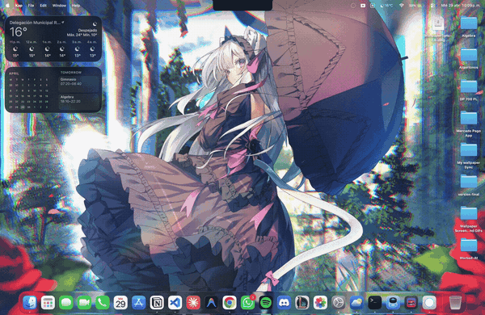
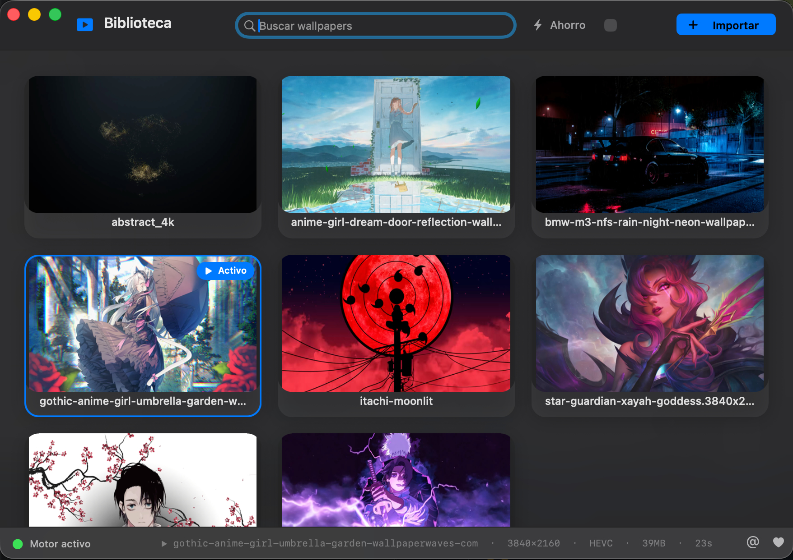
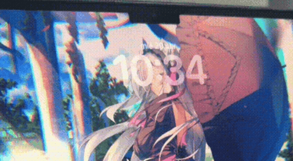
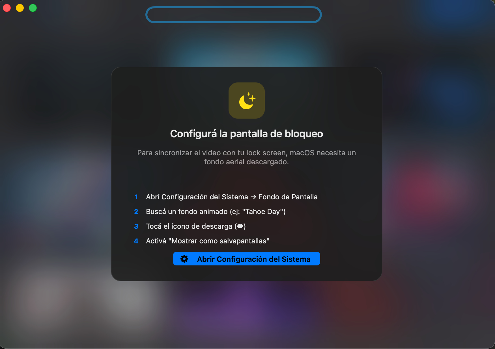
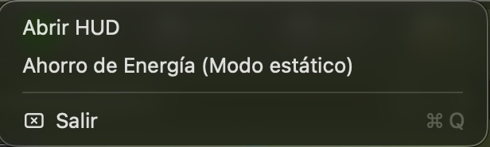

# 🎬 Wallpaper Sync

> **Live animated video wallpapers for macOS — synced to both desktop and lock screen.**
> The only open-source Mac app that puts the *same* video on your desktop background **and** your lock screen, with HEVC hardware decoding and a native menu-bar UI.

[](#requirements)
[](#)
[](LICENSE)
[](https://ceneka.net/gonza_007)
[](https://instagram.com/gonza._007)

> Built by **Gonzalo Rojas** ([@gonza._007](https://instagram.com/gonza._007)). If you find it useful and want to buy me a coffee: **[ceneka.net/gonza_007](https://ceneka.net/gonza_007)** ☕

<p align="center">
  
</p>


## Features

- 🖥️ **Animated desktop wallpaper** — Video plays behind your icons and windows
- 🔒 **Lock screen sync** — Same video on your lock/login screen automatically
- ⚡ **Instant switching** — Change wallpapers in < 1 second (HEVC optimized)
- 🔋 **Battery smart** — Auto-pause on battery to save power
- 🎨 **Native UI** — Liquid-Glass HUD with live search, hover-lift cards, light/dark adaptive
- 📦 **Menu bar app** — Runs silently in the background, no dock clutter
- 🛠️ **Auto-setup** — Installs ffmpeg dependency automatically if needed
- 🌗 **macOS Tahoe ready** — Uses semantic system colors and `NSVisualEffectView` materials

## Why Wallpaper Sync?

There are several apps for animated wallpapers on macOS, but **none of the popular ones touch the lock screen** — because Apple's sandboxing in the Mac App Store prohibits writing to the system aerial files. Wallpaper Sync runs unsandboxed and rewrites the aerial slot atomically, so the same video plays on your desktop *and* when you wake your Mac to the login screen.

| What you want | [Plash](https://github.com/sindresorhus/Plash) | [Aerial](https://github.com/JohnCoates/Aerial) | Live Wallpaper (App Store) | **Wallpaper Sync** |
|---|:---:|:---:|:---:|:---:|
| Animated desktop background | ✅ web pages | ❌ | ✅ | ✅ |
| Same video on lock screen | ❌ | screensaver only | ❌ | ✅ |
| HEVC hardware decode | ⚠️ | ✅ | ⚠️ | ✅ |
| Open source | ✅ | ✅ | ❌ | ✅ |
| Free, no in-app purchases | ✅ | ✅ | freemium | ✅ |
| macOS Tahoe-native UI | ⚠️ | ⚠️ | ⚠️ | ✅ |
| Menu-bar app, no dock icon | ✅ | ❌ | ✅ | ✅ |

If you only need an animated desktop, **Plash** is excellent. If you want the lock screen synced too, this is your option.

## Perfect for

- ☕ **Streamers & content creators** — keep your camera-ready Mac on-brand even when you step away
- 🌃 **Aesthetic Mac setups** — match dock, accent and wallpaper into a single visual language
- 🎨 **Mood / ambient computing** — abstract loops, anime AMVs, looping scenery
- 🔋 **Power-conscious users** — built-in pause-on-battery and a "Power Save" still-frame mode
- 🌙 **Aerial replacers** — drop in your own video without digging through `Application Support`

## Screenshots

<p align="center">
  <br>
  <em>The main HUD with your wallpaper library, live search, power-save toggle, and import button.</em>
</p>

<p align="center">
  <br>
  <em>The same video playing on the macOS lock screen — the killer feature.</em>
</p>

<p align="center">
  <br>
  <em>First-run setup: the app walks you through downloading an aerial wallpaper.</em>
</p>

<p align="center">
  <br>
  <em>Menu bar controls — open the HUD, toggle power saving, or quit.</em>
</p>

## Installation

### Download
1. Download the latest `WallpaperSync-X.Y.dmg` from [Releases](https://github.com/GonzaloRojas14/Wallpaper-Sync/releases)
2. Open the DMG and drag **Wallpaper Sync** to Applications
3. Right-click → **Open** (first time only — the app is not notarized because I don't have an Apple Developer ID, so macOS shows the "unidentified developer" warning)

### First-time Setup
1. The app will offer to install `ffmpeg` if not already present
2. Open **System Settings → Wallpaper** and download an animated wallpaper (e.g., "Tahoe Day")
3. Make sure **"Show as Screen Saver"** is enabled
4. That's it! Import your videos and pick your wallpaper

### Build from Source
```bash
# Clone
git clone https://github.com/GonzaloRojas14/Wallpaper-Sync.git
cd Wallpaper-Sync

# Install dependency
brew install ffmpeg

# Build
./install.sh

# Run
bin/wallpaper set your-video.mp4
```

## Usage

### GUI
Click the **▶︎** icon in the menu bar to open the wallpaper gallery. Click any thumbnail to activate it. The HUD has a live search field, a "Power Save" switch, and quick links to my Instagram and donations in the bottom-right corner.

### CLI
```bash
wallpaper set <file>          # Import + activate a video
wallpaper use <name>          # Switch to a library wallpaper (instant)
wallpaper list                # List library (▶ = active)
wallpaper add <file>          # Import without activating
wallpaper remove <name>       # Delete from library
wallpaper start | stop        # Control the engine
wallpaper battery on|off      # Auto-pause on battery
wallpaper status              # Show current config
```

## How It Works

```
┌─────────────────────────────────────────────────────┐
│  Your Video (.mp4/.mov/.gif)                        │
│       │                                             │
│       ▼                                             │
│  ffmpeg → HEVC .mov (one-time conversion)           │
│       │                                             │
│       ├──→ WallpaperEngine.swift (desktop window)   │
│       │    └─ AVPlayer behind desktop icons         │
│       │                                             │
│       └──→ Aerial slot replacement (lock screen)    │
│            └─ Atomic copy to system aerial file     │
│            └─ Index.plist selectedID update          │
│            └─ killall WallpaperAerialsExtension      │
└─────────────────────────────────────────────────────┘
```

### Architecture
- **WallpaperEngine** (Swift) — Renders video in a borderless window at `desktopIconLevel - 1`
- **MenuApp** (Swift) — Menu bar GUI with wallpaper gallery, import, and engine control
- **bin/wallpaper** (Bash) — CLI tool for all operations
- **_set_lockscreen_video.py** (Python) — Manages the macOS aerial file replacement

### Key Design Decisions
- **Single HEVC format** — Videos are converted once on import. Both desktop and lock screen use the same `.mov` file.
- **No cache needed** — Since conversion happens at import time, switching is just a file copy (~0.1s).
- **Hot-reload** — The engine watches `config.json` via FSEvents and swaps videos without restarting.
- **Sleep/wake safe** — Windows hide on sleep, aerial extension only refreshes when the active video changed.
- **Cold-boot safe** — A poster frame is regenerated atomically on every wallpaper change, so the login screen on a cold boot shows your *current* wallpaper, not the previous one.

## Requirements

- macOS Sonoma (14), Sequoia (15) or Tahoe (26)
- Apple Silicon or Intel Mac
- [ffmpeg](https://formulae.brew.sh/formula/ffmpeg) (installed automatically by the app, or manually via `brew install ffmpeg`)
- One downloaded Aerial wallpaper in System Settings (e.g., "Tahoe Day"). The app shows a setup dialog with the steps the first time.

## Performance

| Metric | Value |
|--------|-------|
| CPU | ~4% average |
| RAM | ~88 MB total |
| GPU | ~22% (4K HEVC hardware decode) |
| Battery impact | ~35% more drain vs static wallpaper |

> **Tip:** Enable `wallpaper battery on` to auto-pause when unplugged.

## Author

**Gonzalo Rojas**
- 📷 Instagram: [@gonza._007](https://instagram.com/gonza._007)
- ☕ Donations: [ceneka.net/gonza_007](https://ceneka.net/gonza_007)
- 🐙 GitHub: [@GonzaloRojas14](https://github.com/GonzaloRojas14)

If Wallpaper Sync saved you time or you like how your Mac ended up looking, consider buying me a coffee — development happens 100% in spare time and any contribution helps keep it going.

## License

MIT — © 2026 Gonzalo Rojas. See [LICENSE](LICENSE).
